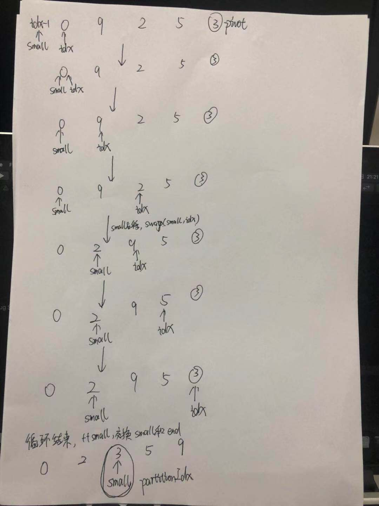

# 快速排序的实现

实现思路：实现快排的关键在于先在数组中选择一个数字，接下来把数组中的数字分为两部分，比选择的数字小的数字移到数组的左边，比选择的数字大的数字移到数组的右边。

划分函数关键实现思路：快速排序Partition函数，主要是求出smallidx，该指针是指向小数组中最右边的元素，最后将其下一个元素和末尾的哨兵互换，最后返回（双指针法 small指针和index指针）

算法具体步骤

* 选基准值：在要排序的序列中选一个基准值，作为划分区间的关键字。通常选取关键字的方式对效率有很大的影响。选取基准值可以是起始位置~终止位置之间的随机值，也可以是起始位置或终止位置。
* 分割序列：按照基准值把序列分为两部分，左边的小于基准值，右边的大于基准值。
* 重复分割：对子序列重复上面的步骤，直到序列为空或者只有一个元素。当递归处理的所有子序列都返回时，序列有序。

算法优化注意的点：

* 使用循环替代递归
* 选取合适的哨兵
* 在递归到规模比较小时，使用选择排序/插入排序代替

```c++
#include <iostream>
#include <vector>
using namespace std;

int Partition(vector<int>& data, int begIdx, int endIdx)
{
    int pivot = data[endIdx]; //选取数组的最后一个元素作为哨兵
    int smallIdx = begIdx - 1;
    for (int index = begIdx; index < endIdx; ++index)
    {
        if (data[index] < pivot)
        {
            ++smallIdx;
            if (index != smallIdx)
            {
                swap(data[smallIdx], data[index]);
            }
        }
    }
    ++smallIdx;
    swap(data[smallIdx], data[endIdx]);//哨兵位置回归
    return smallIdx;
}

void QuickSort(vector<int>& data, int begIdx, int endIdx)
{
    if (data.size() == 0 || begIdx >= endIdx)
    {
        return;
    }
    
    int index = Partition(data, begIdx, endIdx);
    QuickSort(data, begIdx, index - 1);//递归的排序左子数组 begIdx~index-1
    QuickSort(data, index + 1, endIdx);//递归的排序右子数组 index+1~endIdx
    return;
}

int main()
{
    vector<int> arr = {0,9,2,5,3};
    QuickSort(arr, 0, (int)arr.size() - 1);
    for (auto& x : arr)
        cout << x << " ";
    cout << endl;
    
    arr = {1,13,20,57,92,109,308,1023,4502};
    QuickSort(arr, 0, (int)arr.size() - 1);
    for (auto& x : arr)
        cout << x << " ";
    cout << endl;
    return 1;
}
```


Partition()函数实现流程图，图中选取末尾元素3作为哨兵pivot，初始化双指针small=beg -1 ，idx = beg，遍历结束条件为idx < end

