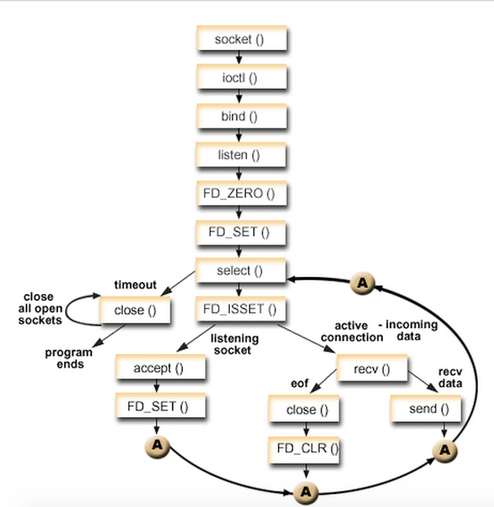

### IO多路复用之select

#### IO多路复用的定义和优势

IO多路复用作为一种特殊的同步IO，可以支持同时监听多个socket，工作原理就是，select/poll/epoll函数会不断的查询所监测的socket文件描述符集合中是否有socket准备好读写了，如果有，系统就会通知用户进程进行后续操作，也即select/poll/epoll调用不再阻塞，将返回就绪的socket个数。

接口介绍：

```c
int select(int maxfdp1, fd_set *readset, fd_set *writeset, fd_set *exceptset, const struct timeval *timeout)//返回值：就绪描述符的数目，超时返回0，出错返回-1
```

* maxfdp1指定待测试的描述字个数，它的值是待测试的最大描述字加1（因此把该参数命名为maxfdp1），描述字0、1、2...maxfdp1-1均将被测试。因为文件描述符是从0开始的。

* 中间的三个参数readset、writeset和exceptset指定我们要让内核测试读、写和异常条件的描述字。如果对某一个的条件不感兴趣，就可以把它设为空指针。struct fd_set可以理解为一个集合，这个集合中存放的是文件描述符，可通过以下四个宏进行设置：

     void FD_ZERO(fd_set *fdset);           //清空集合

     void FD_SET(int fd, fd_set *fdset);   //将一个给定的文件描述符加入集合之中

     void FD_CLR(int fd, fd_set *fdset);   //将一个给定的文件描述符从集合中删除

     int FD_ISSET(int fd, fd_set *fdset);   // 检查集合中指定的文件描述符是否可以读写 

* timeout告知内核等待所指定描述字中的任何一个就绪可花多少时间。其timeval结构用于指定这段时间的秒数和微秒数。这个参数有三种可能：

     永远等待下去：仅在有一个描述字准备好I/O时才返回。为此，把该参数设置为空指针NULL。

     等待一段固定时间：在有一个描述字准备好I/O时返回，但是不超过由该参数所指向的timeval结构中指定的秒数和微秒数。

     根本不等待：检查描述字后立即返回，这称为轮询。为此，该参数必须指向一个timeval结构，而且其中的定时器值必须为0。

select服务执行流程图：




上图流程可简化为：当用户进程调用select的时候，select会将需要监控的描述符集合拷贝到内核空间（假设监控的仅仅是socket可读），然后内核遍历自己监控的socket集合，挨个检查该socket集合是否有可读事件，遍历完所有的socket集合后，如果没有任何一个socket可读，那么select会使得用户进程进入睡眠。如果在timeout时间内某个socket上有数据可读或者等待超时，则调用select的用户进程会被唤醒，接下来select就是遍历监控的socket集合，挨个收集可读事件并返回给用户进程。

从以上select工作流程可以看出，select的几个缺点：

* 每次调用select，都需要把fd集合从用户态拷贝到内核态，这个开销在fd很多时会很大

* select支持的文件描述符数量太小了，默认是1024

* 每次调用select都需要在内核遍历传递进来的所有fd，这个开销在fd很多时也很大

* 被监控的fds中某些有数据可读的时候，我们希望通知更加精细一点，就是我们希望能够从通知中得到有可读事件的fds列表，而不是需要遍历整个fds来收集


select服务端代码：

```c
#include <stdio.h>
#include <stdlib.h>
#include <string.h>
#include <errno.h>
#include <unistd.h>
#include <time.h>
#include <sys/socket.h>
#include <sys/select.h>
#include <sys/types.h>
#include <netinet/in.h>
#include <arpa/inet.h>
#include <netdb.h>
#include <fcntl.h>


#define PORT 8888
#define MAX_LINE 2048
#define LISTENQ 20

/*
int FD_ZERO(int fd, fd_set *fdset);   //一个fd_set类型变量的所有位都设为0
int FD_CLR(int fd, fd_set *fdset);    //清除某个位时可以使用
int FD_SET(int fd, fd_set *fd_set);   //设置变量的某个位置位
int FD_ISSET(int fd, fd_set *fdset);  //测试某个位是否被置位
 */

int main(int argc , char **argv)
{
    int i, maxi, maxfd, listenfd, connfd, sockfd;
    int nready , client[FD_SETSIZE];
    ssize_t n, ret;
    fd_set rset , allset;
    char buf[MAX_LINE];
    socklen_t clilen;
    struct sockaddr_in servaddr , cliaddr;
    
    /*(1) 得到监听描述符*/
    listenfd = socket(AF_INET , SOCK_STREAM , 0);
    
    /*(2) 绑定套接字*/
    bzero(&servaddr , sizeof(servaddr));
    servaddr.sin_family = AF_INET;
    servaddr.sin_addr.s_addr = htonl(INADDR_ANY);
    servaddr.sin_port = htons(PORT);
    
    bind(listenfd , (struct sockaddr *)&servaddr , sizeof(servaddr));
    
    /*(3) 监听*/
    listen(listenfd , LISTENQ);
    
    /*(4) 设置select*/
    maxfd = listenfd;
    maxi = -1;
    for(i=0 ; i<FD_SETSIZE ; ++i)
    {
        client[i] = -1;
    }//for
    FD_ZERO(&allset);
    FD_SET(listenfd , &allset);//将服务端监听描述符加入所有fd集合中
    
    /*(5) 进入服务器接收请求死循环*/
    while(1)
    {
        rset = allset;
        nready = select(maxfd+1 , &rset , NULL , NULL , NULL);//阻塞
        
        if(FD_ISSET(listenfd , &rset))
        {
            /*接收客户端的请求*/
            clilen = sizeof(cliaddr);
            
            printf("\naccpet connection~\n");
            
            if((connfd = accept(listenfd , (struct sockaddr *)&cliaddr , &clilen)) < 0)
            {
                perror("accept error.\n");
                exit(1);
            }//if
            
            printf("accpet a new client: %s:%d\n", inet_ntoa(cliaddr.sin_addr) , cliaddr.sin_port);
            
            /*将客户链接套接字描述符添加到数组*/
            for(i=0 ; i<FD_SETSIZE ; ++i)
            {
                if(client[i] < 0)
                {
                    client[i] = connfd;
                    break;
                }//if
            }//for
            
            if(FD_SETSIZE == i)
            {
                perror("too many connection.\n");
                exit(1);
            }//if
            
            FD_SET(connfd , &allset);
            if(connfd > maxfd)
                maxfd = connfd;
            if(i > maxi)
                maxi = i;
            
            if(--nready < 0)
                continue;
        }//if
        
        for(i=0; i<=maxi ; ++i)
        {
            if((sockfd = client[i]) < 0)
                continue;
            if(FD_ISSET(sockfd , &rset))
            {
                /*处理客户请求*/
                printf("\nreading the socket~~~ \n");
                
                bzero(buf , MAX_LINE);
                if((n = read(sockfd , buf , MAX_LINE)) <= 0)
                {
                    close(sockfd);
                    FD_CLR(sockfd , &allset);
                    client[i] = -1;
                }//if
                else{
                    printf("clint[%d] send message: %s\n", i , buf);
                    if((ret = write(sockfd , buf , n)) != n)
                    {
                        printf("error writing to the sockfd!\n");
                        break;
                    }//if
                }//else
                if(--nready <= 0)
                    break;
            }//if
        }//for
    }//while
}
```


select客户端代码：

```c

#include <stdio.h>
#include <stdlib.h>
#include <string.h>
#include <errno.h>
#include <unistd.h>
#include <time.h>
#include <sys/socket.h>
#include <sys/select.h>
#include <sys/types.h>
#include <netinet/in.h>
#include <arpa/inet.h>
#include <netdb.h>
#include <fcntl.h>

#define PORT 8888
#define MAX_LINE 2048

int max(int a , int b)
{
    return a > b ? a : b;
}

/*readline函数实现*/
ssize_t readline(int fd, char *vptr, size_t maxlen)
{
    ssize_t    n, rc;
    char    c, *ptr;
    
    ptr = vptr;
    for (n = 1; n < maxlen; n++) {
        if ( (rc = read(fd, &c,1)) == 1) {
            *ptr++ = c;
            if (c == '\n')
                break;    /* newline is stored, like fgets() */
        } else if (rc == 0) {
            *ptr = 0;
            return(n - 1);    /* EOF, n - 1 bytes were read */
        } else
            return(-1);        /* error, errno set by read() */
    }
    
    *ptr = 0;    /* null terminate like fgets() */
    return(n);
}

/*普通客户端消息处理函数*/
void str_cli(int sockfd)
{
    /*发送和接收缓冲区*/
    char sendline[MAX_LINE] , recvline[MAX_LINE];
    while(fgets(sendline , MAX_LINE , stdin) != NULL)
    {
        write(sockfd , sendline , strlen(sendline));
        
        bzero(recvline , MAX_LINE);
        if(readline(sockfd , recvline , MAX_LINE) == 0)
        {
            perror("server terminated prematurely");
            exit(1);
        }//if
        
        if(fputs(recvline , stdout) == EOF)
        {
            perror("fputs error");
            exit(1);
        }//if
        
        bzero(sendline , MAX_LINE);
    }//while
}

/*采用select的客户端消息处理函数*/
void str_cli2(FILE* fp , int sockfd)
{
    int maxfd;
    fd_set rset;
    /*发送和接收缓冲区*/
    char sendline[MAX_LINE] , recvline[MAX_LINE];
    
    FD_ZERO(&rset);
    while(1)
    {
        /*将文件描述符和套接字描述符添加到rset描述符集*/
        FD_SET(fileno(fp) , &rset);
        FD_SET(sockfd , &rset);
        maxfd = max(fileno(fp) , sockfd) + 1;
        select(maxfd , &rset , NULL , NULL , NULL);
        
        if(FD_ISSET(fileno(fp) , &rset))
        {
            if(fgets(sendline , MAX_LINE , fp) == NULL)
            {
                printf("read nothing~\n");
                close(sockfd); /*all done*/
                return ;
            }//if
            sendline[strlen(sendline) - 1] = '\0';
            write(sockfd , sendline , strlen(sendline));
        }//if
        
        if(FD_ISSET(sockfd , &rset))
        {
            if(readline(sockfd , recvline , MAX_LINE) == 0)
            {
                perror("handleMsg: server terminated prematurely.\n");
                exit(1);
            }//if
            
            if(fputs(recvline , stdout) == EOF)
            {
                perror("fputs error");
                exit(1);
            }//if
        }//if
    }//while
}

int main()
{
    /*声明套接字和链接服务器地址*/
    int sockfd;
    struct sockaddr_in servaddr;
    
    /*(1) 创建套接字*/
    if((sockfd = socket(AF_INET , SOCK_STREAM , 0)) == -1)
    {
        perror("socket error");
        exit(1);
    }//if
    
    /*(2) 设置链接服务器地址结构*/
    bzero(&servaddr , sizeof(servaddr));
    servaddr.sin_family = AF_INET;
    servaddr.sin_port = htons(PORT);
    if(inet_pton(AF_INET , "127.0.0.1" , &servaddr.sin_addr) < 0)
    {
        printf("inet_pton error for 127.0.0.1\n");
        exit(1);
    }//if
    
    /*(3) 发送链接服务器请求*/
    if(connect(sockfd , (struct sockaddr *)&servaddr , sizeof(servaddr)) < 0)
    {
        perror("connect error");
        exit(1);
    }//if
    
    /*调用普通消息处理函数*/
    str_cli(sockfd);
    /*调用采用select技术的消息处理函数*/
    //str_cli2(stdin , sockfd);
    exit(0);
}
```
