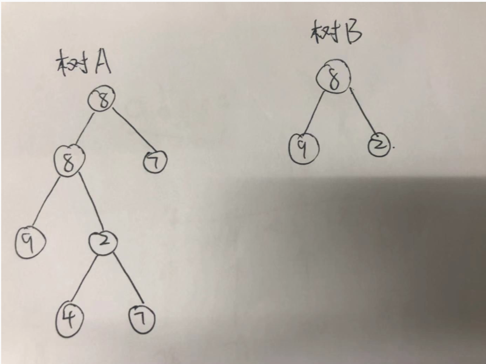

# 树的子结构

>题目：出入两课二叉树A和B，判断B是不是A的子结构

思路分为两大步骤，分布两个递归实现

第一步根节点相等判断逻辑：

* 先判断树的根节点，如果一样则进入主子树判断逻辑；
* 如果不一样，则定位到主树的左子节点，以该节点为根继续进行根节点判断相等逻辑
* 如果依旧不一样，则定位到主树的右子节点，以该节点为根继续进行根节点判断相等逻辑

第二步是否为子树判断逻辑：

- 根节点相等 && 左子树相等 && 右子树相等 则认为相等
- 递归过程中，遇到子树节点为null，说明已经遍历子树的末端，此时不管主树节点是否为null，都返回true
- 递归过程中，遇到子树节点不为null，但主树节点为null，返回false


边界测试case：空指针输入、树B是树A的子树、树B不是树A的子树、树A或树B只有一个节点

代码：

```c++
/**
 * 1.先比较两个树的头结点是否相等 2.若相等,进一步比较左子树和右子树
 */
class Solution {
public:
    bool check(BinaryTreeNode *pRoot1, BinaryTreeNode *pRoot2)
    {
        if (pRoot2 == nullptr)//说明已经遍历子树的末端，此时不管主树节点是null还是有值，都返回true
        {
            return true;
        }
        
        if (pRoot1 == nullptr)//子树节点不为空，但主树节点为空，返回false
        {
            return false;
        }
        return (pRoot1->val == pRoot2->val) && (check(pRoot1->lchild, pRoot2->lchild) && check(pRoot1->rchild, pRoot2->rchild));
    }
    
    bool IsSubTree(BinaryTreeNode *pRoot1, BinaryTreeNode *pRoot2)
    {
        bool result = false;
        if (pRoot1 == nullptr || pRoot2 == nullptr)
        {
            return result;
        }
        if (pRoot1->val == pRoot2->val)
        {
            result = check(pRoot1, pRoot2);
        }
        if (!result)
        {
            result = IsSubTree(pRoot1->lchild, pRoot2);
        }
        if (!result)
        {
            result = IsSubTree(pRoot1->rchild, pRoot2);
        }
        return result;
    }
};
```


测试用例的构建（根据先序遍历创建二叉树结构）：

```c++
#include <iostream>
#include <vector>
#include <cmath>
using namespace std;

struct BinaryTreeNode {
    int val;
    BinaryTreeNode *lchild;
    BinaryTreeNode *rchild;
};

/**
 * 根据先序序列构建二叉树(因为涉及到对根节点指针修改，因此传递根节点指针的引用)
 */
string strNodes;
int cnt = 0;
void CreateBiTree(BinaryTreeNode*& t)
{
    if (strNodes[cnt ++] == '#') {
        t = NULL;
    } else {
        t = (BinaryTreeNode*)malloc(sizeof(BinaryTreeNode));
        t->val = strNodes[cnt - 1] - '0';
        CreateBiTree(t->lchild);
        CreateBiTree(t->rchild);
    }
    return;
}

int main()
{
    //case1
    strNodes = "889##24##7##7##";
    cnt = 0;
    BinaryTreeNode* pRoot1 = NULL;
    CreateBiTree(pRoot1);
    strNodes = "89##2##";
    cnt = 0;
    BinaryTreeNode* pRoot2 = NULL;
    CreateBiTree(pRoot2);
    
    Solution so;
    cout << so.IsSubTree(pRoot1, pRoot2) << endl;
    
    //case2
    strNodes = "889##24##7##7##";
    cnt = 0;
    pRoot1 = NULL;
    CreateBiTree(pRoot1);
    strNodes = "8##";
    cnt = 0;
    pRoot2 = NULL;
    CreateBiTree(pRoot2);
    
    cout << so.IsSubTree(pRoot1, pRoot2) << endl;
    return 0;
}
```

case1的二叉树结构如图所示：

