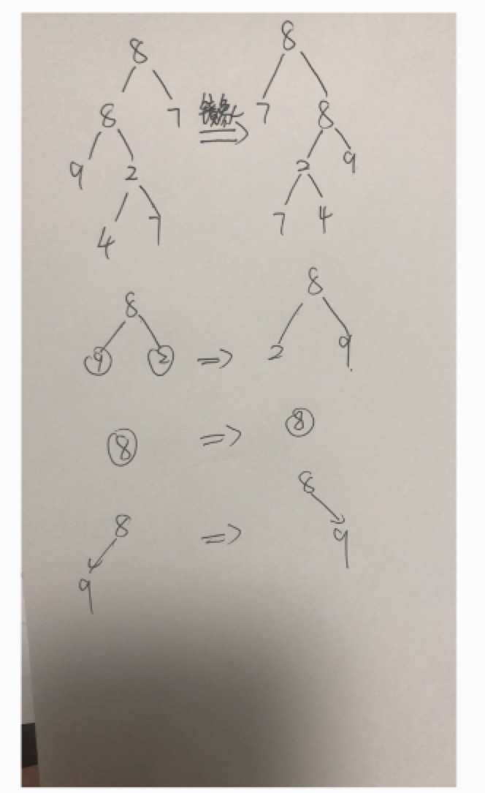

# 面试题19 二叉树的镜像

>题目：请完成一个函数，输入一个二叉树，该函数输出它的镜像树

思路：递归的去进行树的左右节点替换。

代码：

```c++
void MirrorTree(BinaryTreeNode* pHead)
{
    if (pHead == nullptr)
    {
        return;
    }
    if (!pHead->lchild && !pHead->rchild)
    {
        return;
    }
    BinaryTreeNode* tmp = pHead->lchild;
    pHead->lchild = pHead->rchild;
    pHead->rchild = tmp;
    
    if (pHead->lchild)
        MirrorTree(pHead->lchild);
    if (pHead->rchild)
        MirrorTree(pHead->rchild);
    return;
}
```


测试用例的构建（根据先序遍历创建二叉树结构）：

```c++
#include <iostream>
#include <vector>
using namespace std;

struct BinaryTreeNode
{
    int val;
    BinaryTreeNode *lchild;
    BinaryTreeNode *rchild;
};


void MirrorTree(BinaryTreeNode* pHead)
{
    if (pHead == nullptr)
    {
        return;
    }
    if (!pHead->lchild && !pHead->rchild)
    {
        return;
    }
    BinaryTreeNode* tmp = pHead->lchild;
    pHead->lchild = pHead->rchild;
    pHead->rchild = tmp;
    
    if (pHead->lchild)
        MirrorTree(pHead->lchild);
    if (pHead->rchild)
        MirrorTree(pHead->rchild);
    return;
}

/**
 * 根据先序序列构建二叉树(因为涉及到对根节点指针修改，因此传递根节点指针的引用)
 */
string strNodes;
int cnt = 0;
void CreateBiTree(BinaryTreeNode*& t)
{
    if (strNodes[cnt ++] == '#') {
        t = NULL;
    } else {
        t = (BinaryTreeNode*)malloc(sizeof(BinaryTreeNode));
        t->val = strNodes[cnt - 1] - '0';
        CreateBiTree(t->lchild);
        CreateBiTree(t->rchild);
    }
    return;
}

int main()
{
    strNodes = "889##24##7##7##";
    cnt = 0;
    BinaryTreeNode* pRoot1 = NULL;
    CreateBiTree(pRoot1);
    MirrorTree(pRoot1);
    
    strNodes = "89##2##";
    cnt = 0;
    BinaryTreeNode* pRoot2 = NULL;
    CreateBiTree(pRoot2);
    MirrorTree(pRoot2);
    
    strNodes = "8##";
    cnt = 0;
    BinaryTreeNode* pRoot3 = NULL;
    CreateBiTree(pRoot3);
    MirrorTree(pRoot3);
    
    strNodes = "89###";
    cnt = 0;
    BinaryTreeNode* pRoot4 = NULL;
    CreateBiTree(pRoot4);
    MirrorTree(pRoot4);
    return 0;
}
```

case1的二叉树结构如图所示：

